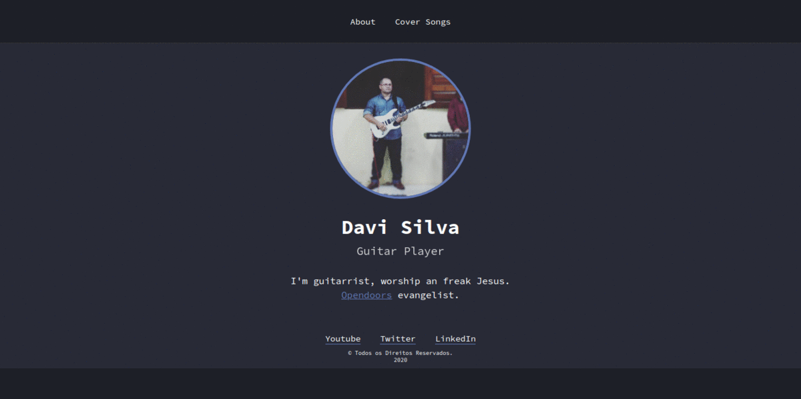

# Simple Site



## Installation

- OS X, Windows & Linux:

```git
git clone git@github.com:davi1985/simple-site.git
```

_You can download zip folder._

Open in Visual Studio Code or other editor. In VSC just use the extension 'Live Server' and done.

## Technologies

- HTML
- CSS
- Javascript

One of must important and interesting part in this project is a modal builded with Javascript Vanilla.

## Meta

Davi Silva – [@dssilvap](https://twitter.com/dssilvap) – dssilvap@hotmail.com

[https://github.com/davi1985](https://github.com/davi1985)
